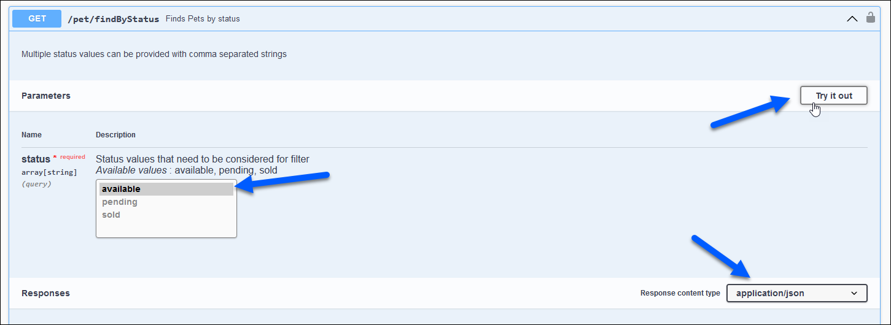

# Petstore API tutorial

Welcome! If you're looking to familiarize yourself with the concept of APIs and how to use them, you've come to the right place. This how-to guide will provide a brief introduction to the Petstore API and provide a simple, step-by-step example of how to to use the API and render the response in a web page.

Let's get started!

## The Petstore API
[The Petstore API](https://petstore.swagger.io) is a REST API which simulates a server for a pet store. It's an excellent learning resource for those who are new to APIs, as it's extremely straightforward to use and requires no authorization.

The Petstore API documentation is hosted in [Swagger UI](https://swagger.io/tools/swagger-ui/), an interactive API documentation tool.

### Endpoints
The Petstore API has 3 endpoints: /pet, /store, and /user.

The **/pet** endpoint provides a number of services related to, you guessed it, pets!

[View the /pet documentation.](https://petstore.swagger.io/#/pet)

The **/store** endpoint provides services related to customer orders and store inventory.

[View the /store documentation.](https://petstore.swagger.io/#/store)

Finally, the **/user** endpoint provides services related to users of the Petstore.

[View the /user documentation.](https://petstore.swagger.io/#/user)

## /pet/findByStatus

For this tutorial, we will utilize the [/pet/findByStatus](https://petstore.swagger.io/#/pet/findPetsByStatus) method to retrieve a list of pets.

This GET call takes one parameter denoting the pet status and will return an array of all Pet objects in the database which have that status.

This method returns data in either XML or JSON. For this tutorial, we'll work with a JSON response.

The Pet object is structured thusly: 

```json
{
  "id": 0,
  "category": {
    "id": 0,
    "name": "string"
  },
  "name": "doggie",
  "photoUrls": [
    "string"
  ],
  "tags": [
    {
      "id": 0,
      "name": "string"
    }
  ],
  "status": "available"
}
```

## Test the method

For our example, we're going to produce a list of all pets in the database with a status of 'Available'.

You can test the method via a tool in the [documentation](https://petstore.swagger.io/#/pet/findPetsByStatus).

Click the 'Try it out' button, set the query parameter to 'Available', and ensure that the content-type is set to 'application/json'. 



Click 'Execute' to run the call.

Alternatively, you can enter the following cURL code into a console to generate the same result:
```curl
curl -X 'GET' \
  'https://petstore.swagger.io/v2/pet/findByStatus?status=available' \
  -H 'accept: application/json'
```

## Render the response with Fetch API & Codepen

We're going to build a simple website with [Codepen](https://codepen.io) to call the API and render the results in a table.

Create a table in HTML with the ID 'pets' in the body element.

For instance: 
```html
<body>
  <h1>Petstore API</h1>
  <h2>Available pets</h2>
  <hr>
  <table id="pets"></table>
  <script src="main.js"></script>
</body>
```

Employ whatever additional HTML and CSS you wish.

Next, we will utilize the [Fetch API](https://developer.mozilla.org/en-US/docs/Web/API/Fetch_API) to call the Petstore API, gather the JSON response, and feed the data into a table. The Fetch API's ``fetch()`` method is a simple tool to asynchronously fetch resources from a target. 

We can achieve this with the following Javascript:

```js
// Call the API
fetch("https://petstore.swagger.io/v2/pet/findByStatus?status=available")
  // Convert the response to JSON
  .then((response) => response.json())
  .then((json) => {
    // Create a variable to store the table headers
    let li = `<tr><th>ID</th><th>Name</th><th>Status</th>`;
    // Iterate through the response and populate rows
    json.forEach((pet) => {
      li += `<tr>
        <td>${pet.id}</td>
        <td>${pet.name} </td>
        <td>${pet.status}</td>
      </tr>`;
    });
    // Display the table
    document.getElementById("pets").innerHTML = li;
  });
```
This will provide a simple table contianing the ID, name, and availability of each Pet object in the Petstore APIs database. More columns can be added to include more data fields from the Pet object as needed.

[Click here to view an example Pen](https://codepen.io/jwcummings/pen/ZERyNYa).

Congratulations! You're all done.

## Learn more
- [Petstore API](https://petstore.swagger.io)
- [Codepen](https://codepen.io)
- [Fetch API](https://developer.mozilla.org/en-US/docs/Web/API/Fetch_API)


